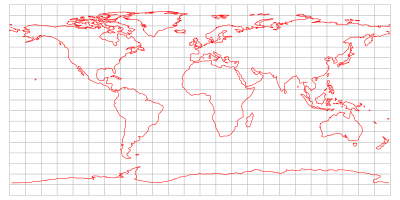

#### 坐标变换
https://github.com/ngram2017/forgejs-test/blob/8860803b4c23b335222efbe2821e987c87d45a71/src/render/shader/ShaderChunk/common/coordinates.glsl

```js
/*
 * (r, theta, phi) --> (x, y, z)
 *
 *              z
 *             |
 *             |  phi    r
 *             |--_    o
 *             |   \  /|
 *             |    /  |
 *             |  /    |
 *             |/      |     y
 *             +-------+-----
 *            / \      |
 *          /     \    |
 *        /     __- \  |
 *      /-------      \|
 *  x /   theta        o
 *
 *
 */
vec3 toCartesian(vec3 rtp) {
  float rsphi = rtp.x * sin(rtp.z);
  return vec3(
    cos(rtp.y) * rsphi,
    sin(rtp.y) * rsphi,
    rtp.x * cos(rtp.z)
  );
}

#pragma glslify: export(toCartesian)


/*
 * (z, y, z) --> (r, phi, theta)
 *
 *              z
 *             |
 *             |  phi    r
 *             |--_    o
 *             |   \  /|
 *             |    /  |
 *             |  /    |
 *             |/      |     y
 *             +-------+-----
 *            / \      |
 *          /     \    |
 *        /     __- \  |
 *      /-------      \|
 *  x /   theta        o
 *
 *
 */
vec3 toSpherical (vec3 xyz) {
  float r = length(xyz);
  float rxy = length(xyz.xy);
  float theta = atan(xyz.y, xyz.x);
  float phi = asin(rxy / r);
  return vec3(r, phi, theta);
}

#pragma glslify: export(toSpherical)
```


#### 等角投影(Equirectangular projection)
> https://en.wikipedia.org/wiki/Equirectangular_projection
> https://mathworld.wolfram.com/CylindricalEquidistantProjection.html


**等角投影**(Equirectangular projection)也称**等距柱面投影**(equidistant cylindrical projection)。

是一种简单的地图投影，投影既不等面积也不保角, 经常用于全景摄影中以表示球面全景图像。

**等角投影**是**圆柱等距投影**，也称为**矩形投影**、**平面图**、**板卡雷图**, 其中横坐标为经度，纵坐标为纬度，因此取标准纬线为phi_1=0。



正投影将球坐标转换为平面坐标。反向投影从平面转换回球体。这些公式假定一个球形模型并使用以下定义：
- ${\displaystyle \lambda } 经度；$
- ${\displaystyle \varphi } 纬度； $
- $ {\displaystyle \varphi _{1}} 标准纬线$
- ${\displaystyle \varphi _{0}} 中心纬线；$
- ${\displaystyle \lambda _{0}} 中心子午线 $
- ${\displaystyle x} 水平坐标；$
- ${\displaystyle y} 垂直坐标；$
经度和纬度变量在此处以弧度定义。

**正向投影**:
$x = (\lambda - \lambda_{0})cos\phi_{1}$
$y = \phi$

**反向投影**:
$\phi = y$
$\lambda = \lambda_{0} + x sec \phi_{1} $
